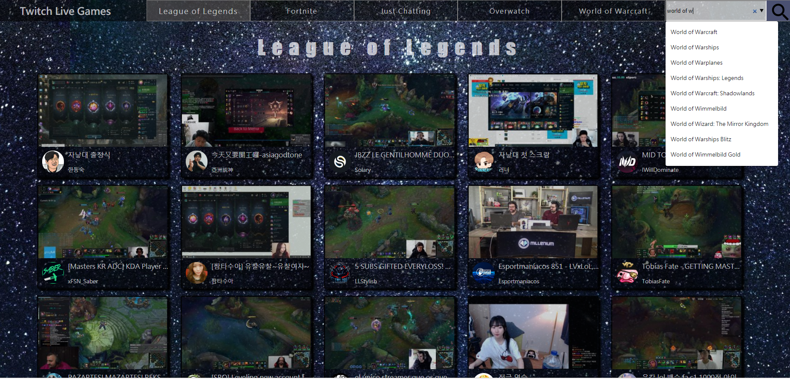

### [Demo](https://lagom0327.github.io/Twitch-practice/) 
### Screenshot

- 搜尋
  - 串接 v5 API 執行搜尋功能
  - 至少輸入三個字才會自動填入可能的答案，如果可能答案不只一個就不填入下方可看到所有可能的答案。
  - 輸入三個字後可直接按 Enter 提交，而搜尋按鈕則是至少要一個字才能提交
  - 沒有的遊戲名稱提交後會跳出 `alert`
- 串接新版 API 拿取最熱門的 5 個遊戲和 Streams
- 往下拉自動載入後 20 個 streams
- 當 streams 沒有更多時會停止自動載入
- 該遊戲沒有任何 stream 時畫面會出現 `現在沒有任何直播`
- 換遊戲時上方的標題和導覽列底色也會自動換

### Built With
- 使用 VanillaJS，透過原生 XMLHttpRequest（XHR）物件和 API 互動，了解底層原理
- 使用 Promise 處理非同步事件
- 使用 Flag `isShowStreams` 避免 `scroll` 事件多次重覆觸發
